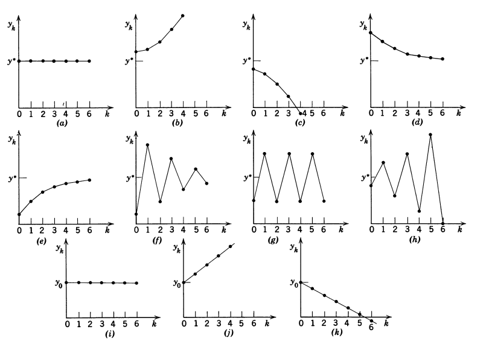

# 1ª Entrega–Exercícios de MA 37 (2025-1)

1. Estude as assíntotas da função 
   $$
   P(x) = \frac 1 {|x+1|} + \frac 1 {|x-1|},\quad x>-1,\quad x\neq 1.
   $$

2. *Amortização* é o processo pelo qual uma dívida é reembolsada por uma sequência de pagamentos periódicos com o objetivo de pagar os juros e, ao mesmo tempo, reduzir o capital devido. Se $D_n$ é o saldo da dívida após o $n$-ésimo pagamento sob o regime de juros compostos a uma taxa $\alpha_n$ no período considerado e pagamento de $a_n$, nesse período, então 
   $$
   D_{n+1} = (1+\alpha_n)D_{n} - a_n.
   $$
   O pagamento que se efetua cada período para realizar a amortização e a taxa podem ser fixas, este último é um modelo mais simples que vamos resolver a seguir. Na compra de uma casa é feito um  financiamento do valor $c_0$ que deve ser pago em 15 anos, em parcelas mensais fixas e iguais a $k$. Determine o juro mensal (fixo) cobrado neste empreendimento.

3. Estude a convergência e estabilidade e classifique as equações abaixo

   

   de acordo com o comportamento do gráfico 
   

4. Qual o tempo necessário para que uma dada quantia em dinheiro dobre a uma taxa de juros simples de 10% ao ano? E se for juro composto?
5. Determine as soluções gerais e estude o equilíbrio:

   1. $y_{n+2} = 3 y_{n+1}-2y_n$
   2. $y_{n+2} = -2y_{n+1}-2y_n$
   3. $y_{n+2} = -2y_{n+1}-y_n$
   4. $y_{n+2}-y_n=0$
   5. $9y_{n+2}-6y_{n+1}+y_n=0$

6. Um economista está interessado na variação do preço de um único produto. Observa-se que um preço elevado do produto no mercado atrai mais fornecedores. No entanto, o aumento da quantidade ofertada tende a reduzir o preço. Com o tempo, há uma interação entre preço e oferta. O economista propõe o seguinte modelo, onde $P_n$ representa o preço no ano $n$, e $Q_n$ representa a quantidade:
   
   $$
   \begin{aligned}
   P_{n+1} &= P_n - 0{,}1(Q_n - 500) \\
   Q_{n+1} &= Q_n + 0{,}2(P_n - 100)
   \end{aligned}
   $$
   (6.1) O modelo faz sentido intuitivamente? Qual o significado das constantes 100 e 500? Explique o significado dos sinais das constantes $-0{,}1$ e $0{,}2$.
   (6.2) Elabore uma planilha e teste as condições iniciais abaixo.
   
   
   | **Caso** | **P₀** | **Q₀** |
   |----------|--------|--------|
   | A        | 100    | 500    |
   | B        | 200    | 500    |
   | C        | 100    | 600    |
   | D        | 100    | 400    |

     (6.3)  Descreva o comportamento de longo prazo (estabilidade) do sistema.
   
   
   
   
   

